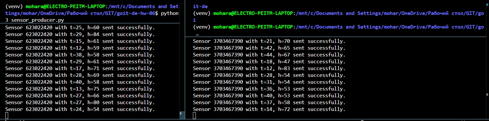
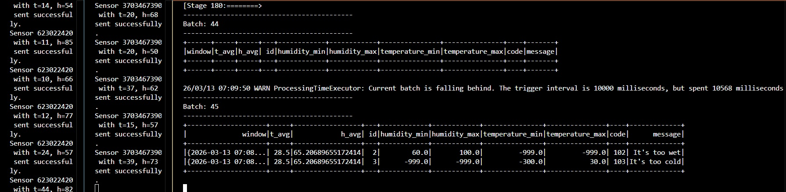
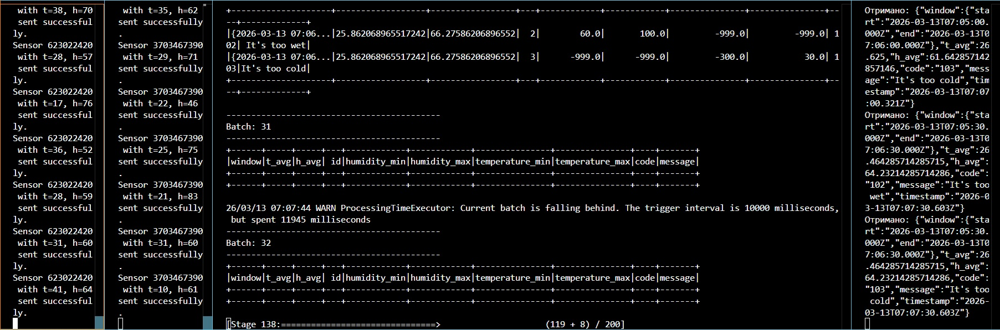

# goit-de-hw-06

1.  Генерації даних сенсорів та відправки даних в building_sensors з демонстрацією двох одночасних роботи двох запусків програми

2. Демонстрація того, що alerts були послані у топік alerts

